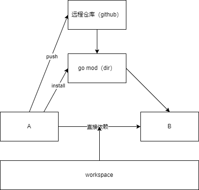

# Go代码

+ skills: 项目开发中的一些基础技能
+ vblog: Vblog项目（单体服务）
+ devcloud-mini: Devcloud-mini（微服务项目）
+ devcloud: 业务项目（Devcloud完整版）

## 基础过度到项目的重点

+ 基础篇：基础技能（用法+原理）
+ 项目篇：软件工程（系统性解决问题的方法，软件设计）

## 项目课体量带来的问题

1. 项目中用到的工具 都是及时更新，20%-30%技术更新
2. 基础篇（单文件，单包开发）；项目课 代码量至少上千，几十个文件或者包共同组成一个工程，项目课代码量多，逻辑复杂
3. 程序跑不起来是正常情况，写的代码一遍能跑起来是惊喜。需要学会自己debug
4. 项目课程中代码多，流程复杂，代码是现场写的，是有几率出现问题，需要现场debug
5. 项目是对基础最好的测试题
6. 基础教的技能是过剩的，基础技能，用的时候能够理解就是OK的。某个点有问题，单独补充回顾或者学习单独的知识点。一个项目中60%能解决，就可以写项目

## 软件开发生命周期

1. 老板的商业洞察，立项（BP），使用对象，市场前景，商业模型（怎么赚钱），开发的方向
2. 产品设计：规划产品
    1. 需求收集：用户的痛点，用户需要的是什么，给谁用的。
    2. 系统设计：前端负责人/后端负责热 测试负责人/运维负责人
       + 概要设计：基本流程跑通，关键字段定义请求，只有一个想清楚业务流程
         + 流程设计：使用流程说明，可以参考竞品
         + 用户界面设计：UI/交互，可以参考竞品
         + 软件架构设计：采用单体服务还是微服务。哪些模块。数据库，是否需要缓存。技术栈和架构设计是一体的。
       + 详细设计：
         + 每个模块，每个具体功能的定义是什么，具体到能出页面，能定义接口，需要评审
         + 产品原型，高保真：使用专门的产品工具：蓝图、axure、figma
    3. 产品研发：
       + 前端：根据原型开发界面，软件对接后端，一起发布进行测试
       + 后端：后端研发负责人，有参与系统架构设计，任务分解
         + 整体规划：服务交互流程，接口定义：
         + 服务A：Vblog
         + 服务B：cmdb
         + 服务C：用户中心
         + 开发环境联合测试
    4. 产品测试 等着版本进行提测
       + 集成测试：功能测试/回归测试/安全测试/性能测试
    5. 运维发布：上线 配置域名 开放给 公网用户使用
       + 灰度验证：单元使用一个业务账号来进行线上测试，内部账号进行测试
       + 灰度发布：0% ~ 100% 到新版本
       + A/B 

产品迭代: 需求 ---> 开发 ---> 验证 ---> 上线

## 开发过程出现的问题

### 单模块工程与多模块工程

在一个工程内初始化两个项目引发的问题如何解决，如何处理多模块问题


1. 单模块工程： 通过vscode打开工程文件的目录
```sh
cd vblog
code .
这个需要安装插件，或者直接打开项目文件夹
```

2. 多模块工程：一次性打开多个项目，直接打开 多个工程的父文件夹

如何处理多模块问题：go workspace 来组织一个代码仓库里的多个项目，处于一个多模块的项目工程下，会优先依赖 该工程下的其他模块代码

正常情况下，两个独立项目都会推送到中央仓库，如果两个项目依赖，都是通过中央仓库来依赖的。



```sh
# 初始化一个工作空间
go work init

# 把项目加入到该空间
go work use ./vblog
go work use ./skills
```

实践过程：

1. 初始化skills项目

```sh
PS D:\Development\go_projects\skills> go mod init "github.com/go_projects/skills"
go: creating new go.mod: module github.com/go_projects/skills
go: to add module requirements and sums:
        go mod tidy
PS D:\Development\go_projects\skills> 
```

2. 导致vblog项目报错，报红

```sh
vblog项目导入的包出现如下问题:

could not import github.com/go_projects/vblog/apps/user (cannot find package "github.com/go_projects/vblog/apps/user" in GOROOT or GOPATH)compiler(BrokenImport)
```

理论上，一个工程里面就应该只有一个go mod，现在执行了两次go mod，导致冲突（初始化了vblog和skills）

3. 解决方法
```sh
PS D:\Development\go_projects> go work init
PS D:\Development\go_projects> go work use ./vblog
PS D:\Development\go_projects> go work use ./skills
PS D:\Development\go_projects>
```

go.work文件描述了当前空间中的项目
```sh
go 1.20

use (
	./skills
	./vblog
)
```
也可以直接在go.work文件中添加其他项目


