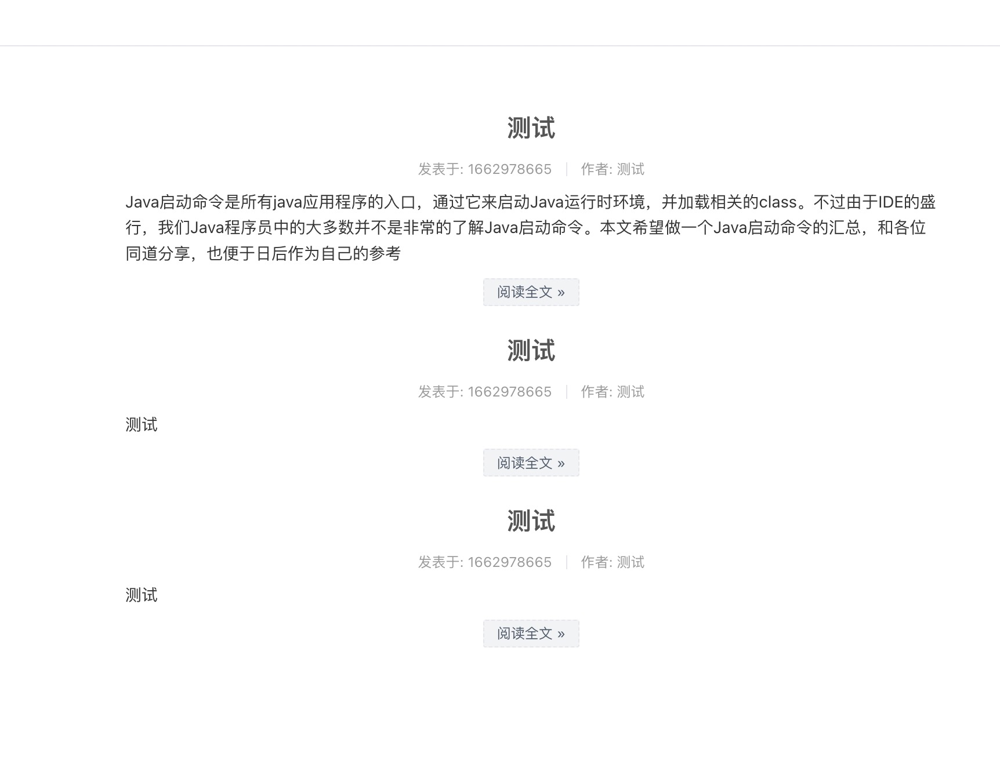
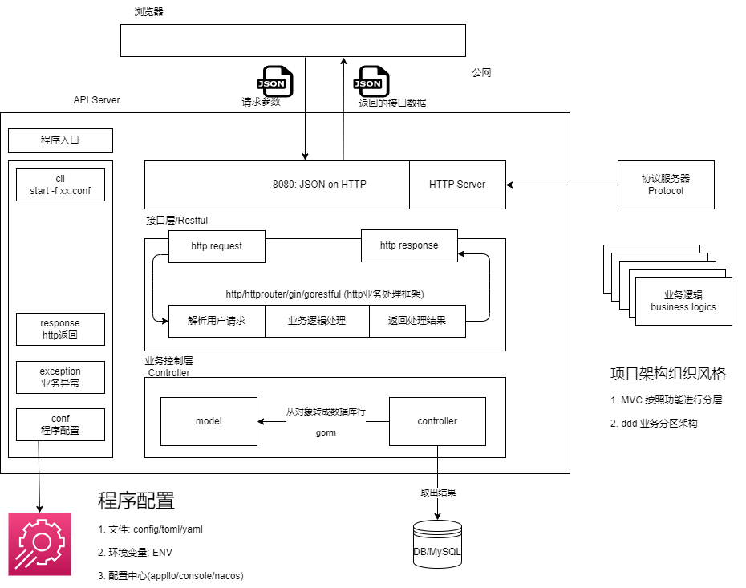
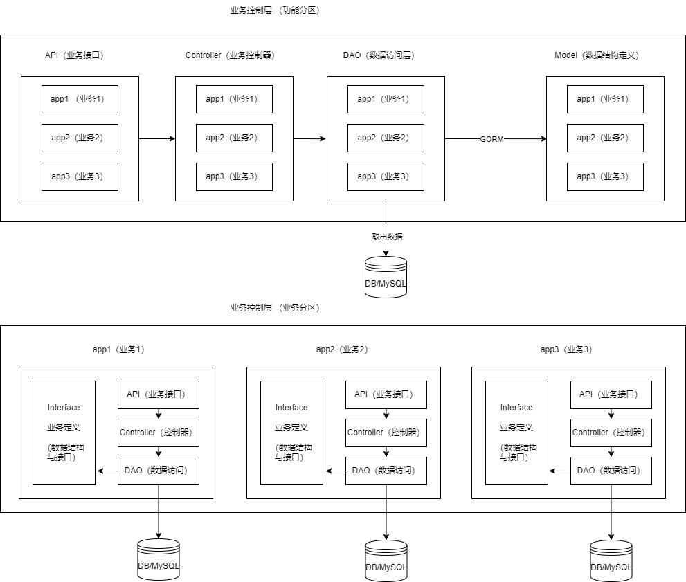
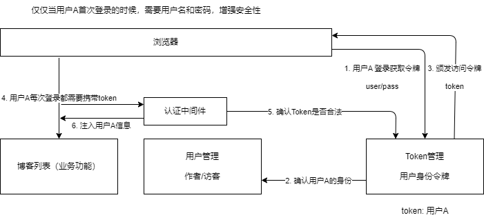

# Web全栈开发（Vblog）

## 需求

需求：博客编写与发布

目标用户：
+ 文章管理者（作者）：写博客的后台
+ 访客：浏览文章的前台

注意：这里流程省略，可以自己补

## 原型

### 博客后台（作者）

1. 列表页


2. 编辑页


### 博客前台（访客）

博客浏览页




## 架构设计

### 整体架构



### 业务代码风格



## 项目开发

### 编写流程

+ 整体框架（上-->下）
+ 业务代码（下-->上）

1. 顶层设计：从上往下进行设计
2. 业务代码：从下往上写，核心应该是业务的实现

### 项目结构

```sh
PS D:\Development\go_projects> cd vblog
PS D:\Development\go_projects\vblog> go mod init "github.com/go_projects/vblog"
go: creating new go.mod: module github.com/go_projects/vblog
go: to add module requirements and sums:
        go mod tidy
PS D:\Development\go_projects\vblog> 
```

+ main.go: 入口文件
+ conf: 程序的配置处理
+ exception: 业务自定义异常。用户的token过期，需要专门定义
+ response: 请求返回的统一数据格式 {"code": 0, "msg": ""}
+ protocol: 协议服务器
+ apps: 业务模块开发区域

### 业务模块



+ 博客管理（Blog）
+ 用户管理（User）
+ 令牌管理（Token）


