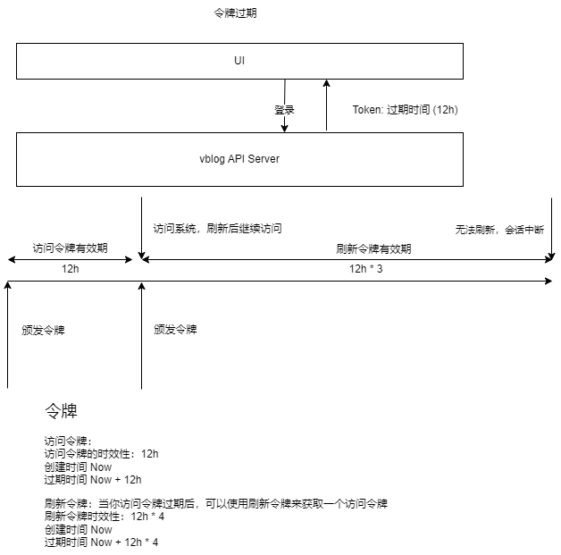
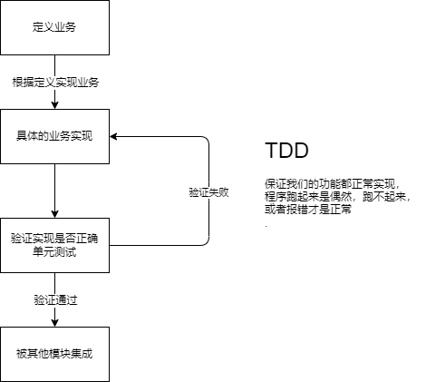
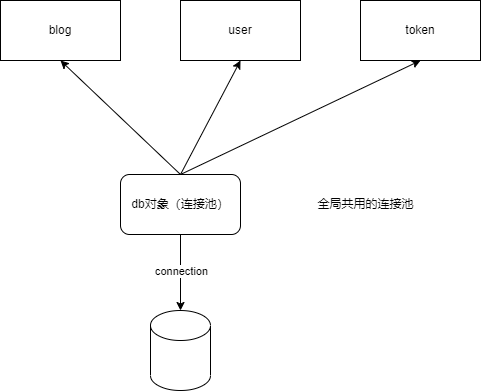
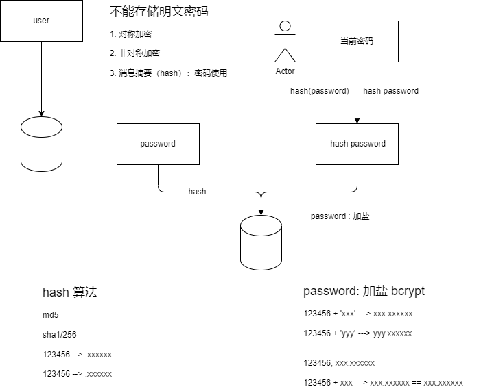

# Web全栈开发（Vblog）

## 需求

需求：博客编写与发布

目标用户：
+ 文章管理者（作者）：写博客的后台
+ 访客：浏览文章的前台

注意：这里流程省略，可以自己补

## 原型

### 博客后台（作者）

1. 列表页


2. 编辑页


### 博客前台（访客）

博客浏览页


## 架构设计

### 整体架构


### 业务代码风格


## 项目开发

### 概要设计（流程）

1. 业务交互流程


+ 博客管理（Blog）
+ 用户管理（User）
+ 令牌管理（Token）

2. 登录过期


### 数据库设计（确认字段）

0. MySQl 8.0.31
```sql
mysql> create user root@'192.168.0.%' identified by '123456';
Query OK, 0 rows affected (0.01 sec)

mysql> CREATE DATABASE vblog DEFAULT CHARACTER SET = 'utf8mb4';
Query OK, 1 row affected (0.00 sec)

mysql> grant all on vblog.* to root@'192.168.0.%';
Query OK, 0 rows affected (0.01 sec)
```


1. 博客管理
```sql
CREATE TABLE `blogs` (
  `id` int unsigned NOT NULL AUTO_INCREMENT COMMENT '文章的Id',
  `tags` text CHARACTER SET utf8mb4 COLLATE utf8mb4_general_ci NOT NULL COMMENT '标签',
  `created_at` int NOT NULL COMMENT '创建时间',
  `published_at` int NOT NULL COMMENT '发布时间',
  `updated_at` int NOT NULL COMMENT '更新时间',
  `title` varchar(255) CHARACTER SET utf8mb4 COLLATE utf8mb4_general_ci NOT NULL COMMENT '文章标题',
  `author` varchar(255) CHARACTER SET utf8mb4 COLLATE utf8mb4_general_ci NOT NULL COMMENT '作者',
  `content` text CHARACTER SET utf8mb4 COLLATE utf8mb4_general_ci NOT NULL COMMENT '文章内容',
  `status` tinyint NOT NULL COMMENT '文章状态',
  `summary` varchar(255) CHARACTER SET utf8mb4 COLLATE utf8mb4_general_ci NOT NULL COMMENT '文章概要信息',
  `create_by` varchar(255) COLLATE utf8mb4_general_ci NOT NULL COMMENT '创建人',
  `audit_at` int NOT NULL COMMENT '审核时间',
  `is_audit_pass` tinyint NOT NULL COMMENT '是否审核通过',
  PRIMARY KEY (`id`),
  UNIQUE KEY `idx_title` (`title`) COMMENT 'titile添加唯一键约束'
) ENGINE=InnoDB AUTO_INCREMENT=47 DEFAULT CHARSET=utf8mb4 COLLATE=utf8mb4_general_ci;
```

说明：
+ tags --> 用于博客分类。使用text，用的时候使用json转换即可
+ title
+ author
+ content --> text
+ status --> tinyint是枚举类型，0代表草稿，1代表发布过的
+ created_at --> 文章的元数据信息
+ published_at --> 文章的元数据信息
+ updated_at --> 文章的元数据信息
+ summary --> 显示在浏览器中的博客内容简介


2. 用户管理
```sql
CREATE TABLE `users` (
  `id` int unsigned NOT NULL AUTO_INCREMENT,
  `created_at` int NOT NULL COMMENT '创建时间',
  `updated_at` int NOT NULL COMMENT '更新时间',
  `username` varchar(255) CHARACTER SET utf8mb4 COLLATE utf8mb4_general_ci NOT NULL COMMENT '用户名, 用户名不允许重复的',
  `password` varchar(255) COLLATE utf8mb4_general_ci NOT NULL COMMENT '不能保持用户的明文密码',
  `label` varchar(255) COLLATE utf8mb4_general_ci NOT NULL COMMENT '用户标签',
  `role` tinyint NOT NULL COMMENT '用户的角色',
  PRIMARY KEY (`id`) USING BTREE,
  UNIQUE KEY `idx_user` (`username`)
) ENGINE=InnoDB AUTO_INCREMENT=5 DEFAULT CHARSET=utf8mb4 COLLATE=utf8mb4_general_ci;
```

说明：
+ role --> 可以考虑基于角色的验证

3. 令牌管理
```sql
CREATE TABLE `tokens` (
  `created_at` int NOT NULL COMMENT '创建时间',
  `updated_at` int NOT NULL COMMENT '更新时间',
  `user_id` int NOT NULL COMMENT '用户的Id',
  `username` varchar(255) CHARACTER SET utf8mb4 COLLATE utf8mb4_general_ci NOT NULL COMMENT '用户名, 用户名不允许重复的',
  `access_token` varchar(255) CHARACTER SET utf8mb4 COLLATE utf8mb4_general_ci NOT NULL COMMENT '用户的访问令牌',
  `access_token_expired_at` int NOT NULL COMMENT '令牌过期时间',
  `refresh_token` varchar(255) COLLATE utf8mb4_general_ci NOT NULL COMMENT '刷新令牌',
  `refresh_token_expired_at` int NOT NULL COMMENT '刷新令牌过期时间',
  PRIMARY KEY (`access_token`) USING BTREE,
  UNIQUE KEY `idx_token` (`access_token`) USING BTREE
) ENGINE=InnoDB DEFAULT CHARSET=utf8mb4 COLLATE=utf8mb4_general_ci;
```

说明：
Token过期的设置，这是业务逻辑，并不是数据本身的问题。

4. 外键问题

```sh
现在流行尽量避免使用外键，由程序增加业务逻辑，自行决定整个关联关系怎么处理
```


### Restful API设计

1. Restful: (Resource) Representational State Transfer（资源状态转换）API风格
+ Resource Representational: 资源定义（服务端对象或者数据库内的一行记录）
+ State Transfer: 创建/修改/删除

这种风格如何表现在API？
```
1. 资源定义
1.1 一类资源
/vblogs/api/v1/blogs: blogs 就是资源的类型： blogs 博客
/vblogs/api/v1/users: users 就是资源的类型： users 用户
1.2 一个资源
/vblogs/api/v1/users/1: 1 就是资源的id，id为1的资源

2. 状态转换：通过HTTP method来定义应有的状态转化，理解为用户的针对某类或者某个资源的动作
POST：创建一个类型的资源，POST /vblogs/api/v1/users 创建一个用户，具体的参数存放在body
PATCH：部分修改（补丁），PATCH /vblogs/api/v1/users/1，对id为1的用户 做属性的部分修改，name:abc （"usera" ---> "abc"）
PUT：全量修改（覆盖），PUT /vblogs/api/v1/users/1，对id为1的用户 做属性的全量修改，name:abc 除去name之外的所有属性全部清空
DELETE：资源删除
GET：获取一类资源：GET /vblogs/api/v1/users，获取一个资源 GET /vblogs/api/v1/users/1
```

其他风格的API
```
POST url命名动作来表示资源的操作：POST /vblogs/api/v1/users/(list/get/delete/update/...)
POST /pods/poda/logs/watch
```

#### 博客管理（设计完整的Restful API）

1. 创建博客： POST /vblogs/api/v1/blogs
```json
{
    "title": "",
    "author": "",
    "content": "",
    "summary": ""
}
```

2. 修改博客（部分）：PATCH /vblogs/api/v1/blogs/:id
```json
{
    "title": "",
    "author": "",
    "content": "",
    "summary": ""
}
```

3. 修改博客（全量）：PUT /vblogs/api/v1/blogs/:id
```json
{
    "title": "",
    "author": "",
    "content": "",
    "summary": ""
}
```

4. 删除博客：DELETE /vblogs/api/v1/blogs/:id
```json
body不传数据
```

5. GET /vblogs/api/v1/blogs/:id
```json
body不传数据
```

#### 令牌管理（设计基础必须，删除和刷新自己完成）

1. POST /vblogs/api/v1/tokens
```json
{
    "username": "",
    "password": "",
    "remember": true,
}
```

2. DELETE /vblogs/api/v1/tokens
```json
body不传数据
```

#### 用户管理
```
功能完整，不做API，可以直接操作数据库，也可以通过单元测试
```

## 项目开发

### 编写流程

+ 整体框架（上-->下）
+ 业务代码（下-->上）

1. 顶层设计：从上往下进行设计
2. 业务代码：从下往上写，核心应该是业务的实现

### 项目结构

```sh
PS D:\Development\go_projects> cd vblog
PS D:\Development\go_projects\vblog> go mod init "github.com/go_projects/vblog"
go: creating new go.mod: module github.com/go_projects/vblog
go: to add module requirements and sums:
        go mod tidy
PS D:\Development\go_projects\vblog> 
```

+ main.go: 入口文件
+ conf: 程序的配置处理
+ exception: 业务自定义异常。用户的token过期，需要专门定义
+ response: 请求返回的统一数据格式 {"code": 0, "msg": ""}
+ protocol: 协议服务器
+ apps: 业务模块开发区域

### 业务模块开发

业务模块开发遵循如下规则：
+ 定义业务（Interface）：梳理需求，抽象业务逻辑，定义出业务的数据结构与接口约束
+ 业务实现（Controller）：根据业务定义，选择具体的技术（比如MySQL/MongoDB/ES），做具体的业务实现
+ 业务接口（API）：如果需要对外提供API，则按需将需要的对外暴露API接口

表现在目录结构上：
+ 定义业务：业务模块顶层目录，具体表现为：user/interface.go(接口定义)
+ 业务实现：业务模块内impl目录，具体表现为：user/impl/impl.go(业务实现对象)
+ 业务接口：业务模块内api目录，具体表现为：user/api/api.go(HTTP Restful接口实现对象)

http API和interface的区别：
+ API: 应用编程接口，HTTP接口，通过网络可以调用
+ interface: 对某个对象（Struct）的约束

### 用户管理模块开发

#### 定义业务
```go
// 面向对象
// user.Service，设计这个模块提供的接口
// 接口定义，一定要考虑兼容性，接口的参数不能变
type Service interface {
	// 用户创建
	// CreateUser(username, password, role string, label map[string]string)
	// 设计CreateUserRequest，可以扩展对象，而不影响接口的定义
  // 返回值尽量用对象来包装
	// 1. 这个接口支持取消吗？要支持取消应该怎么办？
	// 2. 这个接口支持Trace，TraceId怎么传递？
	// 中间件参数，取消/Trace/... 怎么产生怎么传递
	CreateUser(context.Context, *CreateUserRequest) (*User, error)
	// 查询用户列表，对象列表 [{}]
	// 这里返回了*UserSet，目的是返回一个对象，里面可以添加更多参数，方便分页等业务操作
	QueryUser(context.Context, *QueryUserRequest) (*UserSet, error)
	// 查询用户详情，通过Id查询
	DescribeUser(context.Context, *DescribeUserRequest) (*User, error)

	// 作业：
	// 用户修改
	// 用户删除
}
```

#### 业务实现

业务定义层（对业务的抽象），由impl模块来完成具体的功能实现
```go
// 实现 user.Service
// 怎么判断这个服务有没有实现这个接口呢？
// &UserServiceImpl{} 是会分配内存，怎么才能不分配内存?
// var _ user.Service = &UserServiceImpl{}
// nil 如何声明 *UserServiceImpl 的nil
// (*UserServiceImpl)(nil) --> int8 1 int32(1)  (int32)(1)
// nil就是一个*UserServiceIpl的空指针
var _ user.Service = (*UserServiceImpl)(nil)

// 用户创建
func (i *UserServiceImpl) CreateUser(
	ctx context.Context,
	in *user.CreateUserRequest) (
	*user.User, error) {
	return nil, nil
}

// 查询用户列表，对象列表 [{}]
// 这里返回了*UserSet，目的是返回一个对象，里面可以添加更多参数，方便分页等业务操作
func (i *UserServiceImpl) QueryUser(
	ctx context.Context,
	in *user.QueryUserRequest) (
	*user.UserSet, error) {
	return nil, nil
}

// 查询用户详情，通过Id查询
func (i *UserServiceImpl) DescribeUser(
	ctx context.Context,
	in *user.DescribeUserRequest) (
	*user.User, error) {
	return nil, nil
}
```

+ TDD的思想：保证代码质量



1. 怎么验证当前这个业务实现是不是正确的？写单元测试（TDD）

```go
// 怎么引入被测试的对象？
func TestCreateUser(t *testing.T) {
	// 单元测试异常怎么处理
	u, err := i.CreateUser(ctx, nil)
	// 直接报错中断单元流程并且失败
	if err != nil {
		t.Fatal(err)
	}

	// 可以自己进行期望对比，进行单元测试报错
	if u == nil {
		t.Fatal("user not created")
	}

	// 正常打印对象
	t.Log(u)
}
```

2. 业务控制器 如何获取额外依赖（GORM DB对象）




```go
// 怎么实现user.Service接口？
// 定义UserServiceImpl来实现接口
type UserServiceImpl struct {
	// 依赖了一个数据库操作的连接池对象
	db *gorm.DB
}
```

3. 为程序提供配置

```go
package conf

import (
	"fmt"
	"sync"

	"gorm.io/driver/mysql"
	"gorm.io/gorm"
)

// 文件说明：
// 一个Config对象定义，Config对象有一个方法。
// 一个MySQL对象定义，MySQL对象有两个方法。MySQL对象组合到Config对象中。

// 这里不采用直接暴露变量的方式，比较好的方式是使用函数
var config *Config

// 这里就可以补充逻辑
func C() *Config {
	// sync.Lock
	if config == nil {
		// 给个默认值
		config = &Config{}
	}
	return config
}

// 程序配置对象，启动时 会读取配置，并且为程序提供需要的全局变量
// 把配置对象做成全局变量（单例模式）
type Config struct {
	MySQL *MySQL
}

// db对象也是一个单例模式
type MySQL struct {
	Host        string   `json:"host" yaml:"host" toml:"host" env:"DATASOURCE_HOST"`
	Port        int      `json:"port" yaml:"port" toml:"port" env:"DATASOURCE_PORT"`
	DB          string   `json:"database" yaml:"database" toml:"database" env:"DATASOURCE_DB"`
	Username    string   `json:"username" yaml:"username" toml:"username" env:"DATASOURCE_USERNAME"`
	Password    string   `json:"password" yaml:"password" toml:"password" env:"DATASOURCE_PASSWORD"`
	Debug       bool     `json:"debug" yaml:"debug" toml:"debug" env:"DATASOURCE_DEBUG"`

	// 判断这个私有属性，来判断是否返回已有的对象
	db *gorm.DB
	l sync.Mutex
}

// dsn := "user:pass@tcp(127.0.0.1:3306)/dbname?charset=utf8mb4&parseTime=True&loc=Local"
func (m *MySQL) DSN() string {
	return fmt.Sprintf("%s:%s@tcp(%s:%d)/%s?charset=utf8mb4&parseTime=True&loc=Local",
		m.Username,
		m.Password,
		m.Host,
		m.Port,
		m.DB,
	)
}

// 通过配置就能获取一个DB实例
func (m *MySQL) GetDB() *gorm.DB {	
	// 避免多个Goroutine，同时执行打开操作，加互斥锁。把并行变成串行。
	m.l.Lock()
	defer m.l.Unlock()

	if m.db == nil {
		db, err := gorm.Open(mysql.Open(m.DSN()), &gorm.Config{})
		if err != nil {
			panic(err)
		}
		m.db = db
	}
	
	return m.db
}

// 配置对象提供全局单例配置
func (c *Config) DB() *gorm.DB {
	return c.MySQL.GetDB()
}

```

4. 使用配置提供DB对象完成控制器的依赖
```go
func NewUserServiceImpl() *UserServiceImpl {
	return &UserServiceImpl{
		// 获取全局的DB对象
		// 前提：配置对象准备完成
		db: conf.C().DB(),
	}
}
```

5. 程序的校验

使用validator来进行参数的校验 "github.com/go-playground/validator/v10"


6. 使用单元测试验证实现的准确性：
```go
package impl_test

import (
	"context"
	"testing"

	"github.com/go_projects/vblog/apps/user"
	"github.com/go_projects/vblog/apps/user/impl"
)

var (
	i   user.Service
	ctx = context.Background()
)

// 怎么引入被测试的对象？
func TestCreateUser(t *testing.T) {
	// 使用构造函数创建请求对象
	req := user.NewCreateUserRequest()
	// user.CreateUserRequest{} 这样写很容易出现空指针
	req.Username = "member"
	req.Password = "123456"
	req.Role = user.ROLE_ADMIN

	// 单元测试异常怎么处理
	u, err := i.CreateUser(ctx, req)
	// 直接报错中断单元流程并且失败
	if err != nil {
		t.Fatal(err)
	}

	// 可以自己进行期望对比，进行单元测试报错
	if u == nil {
		t.Fatal("user not created")
	}

	// 正常打印对象
	t.Log(u)
}

func TestQueryUser(t *testing.T) {
	req := user.NewQueryUserRequest()
	ul, err := i.QueryUser(ctx, req)
	// 直接报错中断单元流程并且失败
	if err != nil {
		t.Fatal(err)
	}
	t.Log(ul)
}

func TestDescribeUser(t *testing.T) {
	req := user.NewDescribeUserRequest(6)
	ul, err := i.DescribeUser(ctx, req)
	// 直接报错中断单元流程并且失败
	if err != nil {
		t.Fatal(err)
	}
	t.Log(ul)
}

func init() {
	// 加载被测试对象，i 就是User Service接口的具体实现对象
	i = impl.NewUserServiceImpl()
}
```

#### 用户密码的存储问题

问题：
1. 用户密码明文存储在数据库当中
2. 哪些情况下需要把用户的密码查询出来，进程内调用可以查询，接口暴露时屏蔽

方案：



1. HashPassword 方法内实现 hash
```go
// $2a$10$EoGVEGJL3HUnptnN/Nc0ZOyPKJQ91x3IOlx6d5aeDRw.UHhFfOUlK
// $2a$10$x9nCIHuWadFW2WRsnLu1JO8X2XytaR/FWrYy4q0sSWuk4ps0iEY/y
// https://gitee.com/infraboard/go-course/blob/master/day09/go-hash.md#bcrypt
func TestHashedPassword(t *testing.T) {
	req := user.NewCreateUserRequest()
	req.Password = "123456"
	req.HashedPassword()
	t.Log(req.Password)

	t.Log(req.CheckPassword("1234561"))
}
```

### 令牌管理模块开发

#### 业务定义

```go
// Token Service 接口定义

type Service interface {
	// 登录： 颁发令牌
	IssueToken(context.Context, *IssueTokenRequest) (*Token, error)

	// 退出：撤销令牌
	RevokeToken(context.Context, *RevokeTokenRequest) (*Token, error)

	// 校验令牌
	ValidateToken()

}
```

#### 业务具体实现

1. 如何处理模块间关联关系（面向接口编写）
```go
// 登录：颁发令牌
// 依赖User模块来校验 用户密码是否正确
func (i *TokenServiceImpl) IssueToken(
	ctx context.Context,
	in *token.IssueTokenRequest) (
	*token.Token, error) {
	
	// 1. 确认用户密码是否正确
	req := user.NewQueryUserRequest()
	req.Username = in.Username
	us, err := i.user.QueryUser(ctx, req)
	if err != nil {
		return nil, err
	}
	if len(us.Items) == 0 {
		return nil, fmt.Errorf("用户名或者密码错误")
	}

	// 校验密码是否正确
	if err := us.Items[0].CheckPassword(in.Password); err != nil {
		return nil, err
	}

	// 2. 正确的请求下 颁发用户令牌
	return nil, nil
}
```
2. 颁发Token
```go
/*
	{
          "user_id": "11",
          "username": "admin",
          "access_token": "cmlcaoca0uths53c6j4g",
          "access_token_expired_at": 7200,
          "refresh_token": "cmlcaoca0uths53c6j50",
          "refresh_token_expired_at": 28800,
          "created_at": 1705690465,
          "updated_at": 1705690465,
          "role": 1
    }
*/
func TestIssueToken(t *testing.T) {
	req := token.NewIssueTokenRequest("admin", "123456")
	req.RemindMe = true
	tk, err := i.IssueToken(ctx, req)
	if err != nil {
		t.Fatal()
	}
	t.Log(tk)
}
```

3. 撤销Token
```go
func TestRevokeToken(t *testing.T) {
	req := token.NewRevokeTokenRequest(
		"cmlcakka0uti117ngqp0",
		"cmlcakka0uti117ngqpg",
	)
	tk, err := i.RevokeToken(ctx, req)
	if err != nil {
		t.Fatal(err)
	}
	t.Log(tk)
}
```

4. 校验Token
```go
// refresh token expired 5233.530429 minutes
/* 
	{
          "user_id": "11",
          "username": "admin",
          "access_token": "cmlcbuca0uti92286di0",
          "access_token_expired_at": 604800,
          "refresh_token": "cmlcbuca0uti92286dig",
          "refresh_token_expired_at": 2419200,
          "created_at": 1705690617,
          "updated_at": 1705690617,
          "role": 0
    }
*/ 
func TestValidateToken(t *testing.T) {
	req := token.NewValidateTokenRequest("cmlcbuca0uti92286di0")
	tk, err := i.ValidateToken(ctx, req)
	if err != nil {
		t.Fatal(err)
	}
	t.Log(tk)
}
```

5. 业务自定义异常


#### 业务API开发


使用Gin做开发API的接口：接口的状态管理（Cookie）
+ LogIn: 登录，令牌的颁发
	+ 1. Token颁发Token
	+ 2. 颁发完成后，使用SetCookie 通知前端（浏览器），把Cookie设置到本地
+ LogOut：登出，令牌的销毁
	+ 1. Token服务销毁Token
	+ 2. 使用SetCookie 通知前端 重新设置Cookie为""


1. 定义实现接口对象：TokenApiHandler:
```go
// 来实现对外提供 RESTful 接口
type TokenApiHandler struct {
	svc token.Service
}

// 如何为Handler添加路由，如何把路由注册给Http Server
func (h *TokenApiHandler) Registry() {
	// 每个业务模块 都需要往Gin Engine对象注册路由
	r := gin.Default()
	r.POST("/vblog/api/v1/tokens", h.Login)
	r.DELETE("/vblog/api/v1/tokens", h.Logout)
}

// 登录
func (h *TokenApiHandler) Login(ctx *gin.Context) {

}

// 退出
func (h *TokenApiHandler) Logout(ctx *gin.Context) {

}
```

2. 设计模块路由：如何让每个模块的路由不冲突，每个业务模块，当作一个路由分组： /vblog/api/v1/tokens
+ 前缀：vblog 是服务名称 /order/ /bill/ /product/ /catalog/
+ 功能：api/ui 为了区分api 还是ui（前端） api（后端）
+ 资源版本：v1/v2/v3  这是方便分后端的，前端页面没有的
+ 业务模块名称：tokens，或者资源名称

```go
root path --> /vblog/api/v1
modue path --> /vblog/api/v1/tokens
```

```go
// 如何为Handler添加路由，如何把路由注册给Http Server
// 需要一个Root Router: path prefix: /vblog/api/v1
func (h *TokenApiHandler) Registry(rr gin.IRouter) {
	// 每个业务模块 都需要往Gin Engine对象注册路由
	// r := gin.Default()
	// rr := r.Group("vblog/api/v1")

	// 模块路径
	// /vblog/api/v1/tokens
	mr := rr.Group("token.AppName")
	mr.POST("tokens", h.Login)
	mr.DELETE("tokens", h.Logout)
}
```

3. 接口如何携带请求参数：
+ URL Path: /tokens/xxxx/
+ URL Query String: ?token=xxx&a=1&b=2
+ Header
+ Body

```go
// Body 必须是json
req := token.NewIssueTokenRequest("", "")
if err := c.BindJSON(req); err != nil {
	return 
}
```

4. 如何规范API请求的数据响应格式


5. 实现登录与退出

```go
// 登录
func (h *TokenApiHandler) Login(c *gin.Context) {
	// 1. 解析用户请求
	// http 的请求可以放到哪里，放body，bytes
	// io.ReadAll(c.Request.Body)
	// defer c.Request.Body.Close()
	// json unmarshal json.Unmarshal(body, o)
	
	// Body 必须是json
	req := token.NewIssueTokenRequest("", "")
	if err := c.BindJSON(req); err != nil {
		response.Failed(c, err)
		return
	}
	
	// 2. 业务逻辑处理
	tk, err := h.svc.IssueToken(c.Request.Context(), req)
	if err != nil {
		response.Failed(c, err)
		return
	}

	// 2.1 Set Cookie
	c.SetCookie(
		token.TOKEN_COOKIE_KEY,
		tk.AccessToken,
		tk.AccessTokenExpiredAt,
		"/",
		conf.C().Application.Domain,
		false,
		true,
	)

	// 3. 返回处理结果
	response.Success(c, tk)
}
```

### 组织业务（main）

#### 组装业务

```go
package main

import (
	"github.com/gin-gonic/gin"
	"github.com/go_projects/vblog/apps/token/api"
	token_impl "github.com/go_projects/vblog/apps/token/impl"
	user_impl "github.com/go_projects/vblog/apps/user/impl"
)

func main() {

	// user service impl
	usvc := user_impl.NewUserServiceImpl()

	// token service impl
    tsvc := token_impl.NewTokenServiceImpl(usvc)

	// api
	TokenApiHandler := api.NewTokenApiHandler(tsvc)

	// Protocol
	engine := gin.Default()

	rr := engine.Group("/vblog/api/v1")
	TokenApiHandler.Registry(rr)

	// 把Http协议服务器启动起来
	if err := engine.Run(":8080"); err != nil {
		panic(err)
	}
	
}

```

#### 启动业务

```go
PS D:\Development\go_projects\vblog> go run main.go
[GIN-debug] [WARNING] Creating an Engine instance with the Logger and Recovery middleware already attached.

[GIN-debug] [WARNING] Running in "debug" mode. Switch to "release" mode in production.
 - using env:   export GIN_MODE=release
 - using code:  gin.SetMode(gin.ReleaseMode)

[GIN-debug] POST   /vblog/api/v1/token.AppName/ --> github.com/go_projects/vblog/apps/token/api.(*TokenApiHandler).Login-fm (3 handlers)
[GIN-debug] DELETE /vblog/api/v1/token.AppName/ --> github.com/go_projects/vblog/apps/token/api.(*TokenApiHandler).Logout-fm (3 handlers)
[GIN-debug] [WARNING] You trusted all proxies, this is NOT safe. We recommend you to set a value.
Please check https://pkg.go.dev/github.com/gin-gonic/gin#readme-don-t-trust-all-proxies for details.
[GIN-debug] Listening and serving HTTP on :8080
```

#### 测试

使用postman进行测试

1. 登录

```sh
POST /vblog/api/v1/tokens HTTP/1.1
Host: 127.0.0.1:8080
Content-Type: application/json
Cookie: token=cmom8n4a0utg637isj3g
Content-Length: 56

{
    "username": "admin",
    "password": "123456"
}
```

```json
{
    "user_id": "11",
    "username": "admin",
    "access_token": "cmom8n4a0utg637isj3g",
    "access_token_expired_at": 7200,
    "refresh_token": "cmom8n4a0utg637isj40",
    "refresh_token_expired_at": 28800,
    "created_at": 1706124380,
    "updated_at": 1706124380,
    "role": 1
}
```


2. 退出

```sh
DELETE /vblog/api/v1/tokens?refresh_token=cmom8n4a0utg637isj40 HTTP/1.1
Host: 127.0.0.1:8080
```

### v2版本
[v2版本](./v2.md)

