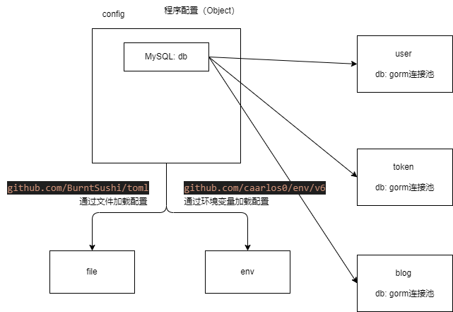

# 程序配置对象


## 配置定义

```go
type Config struct {
	MySQL *MySQL
}

// db对象也是一个单例模式
type MySQL struct {
	Host        string   `json:"host" yaml:"host" toml:"host" env:"DATASOURCE_HOST"`
	Port        int      `json:"port" yaml:"port" toml:"port" env:"DATASOURCE_PORT"`
	DB          string   `json:"database" yaml:"database" toml:"database" env:"DATASOURCE_DB"`
	Username    string   `json:"username" yaml:"username" toml:"username" env:"DATASOURCE_USERNAME"`
	Password    string   `json:"password" yaml:"password" toml:"password" env:"DATASOURCE_PASSWORD"`
	Debug       bool     `json:"debug" yaml:"debug" toml:"debug" env:"DATASOURCE_DEBUG"`

	// 判断这个私有属性，来判断是否返回已有的对象
	db *gorm.DB
	l sync.Mutex
}
```

## 配置加载



### 文件： TOML为例

+ JSON/YAML/TOML： 都有对应格式的解析库

```toml
# {"mysql": {"host": "127.0.0.1","port": 3306, "database": "", "username": "", "password": "", "debug": false, "enable_trace": true}}
[mysql]
  host = "127.0.0.1"
  port = 3306
  database = ""
  username = ""
  password = ""
  debug = false
  enable_trace = true
```
找到toml格式的解析库
github.com/BurntSushi/toml

### 环境变量

解析库：github.com/caarlos0/env/v6

```env
DATASOURCE_HOST="127.0.0.1"
DATASOURCE_PORT=3306
DATASOURCE_DB=""
DATASOURCE_USERNAME=""
DATASOURCE_PASSWORD=""
```

```go
os.Getenv("DATASOURCE_HOST")
```

```go
// "github.com/caarlos0/env/v6" 读取环境变量
// env ---> object
func LoadFromEnv() error {
	c := &Config{}
	// env Tag
	if err := env.Parse(c); err != nil {
		return err
	}
	config = c
	// c.MySQL.Host = os.Getenv("DATASOURCE_HOST")
	return nil
}
```

### 程序的默认值

很多情况下，没有给程序提供任何配置。

提供默认值，让程序基本能跑（开发环境能跑）

```go
func DefaultConfig() *Config {
	return &Config{
		MySQL: &MySQL{
			Host:     "192.168.0.77",
			Port:     3306,
			DB:       "vblog",
			Username: "root",
			Password: "123456",
			Debug:    true,
			// Debug打开的目的：希望GORM的时候把信息打印出来
		},
	}
}
```